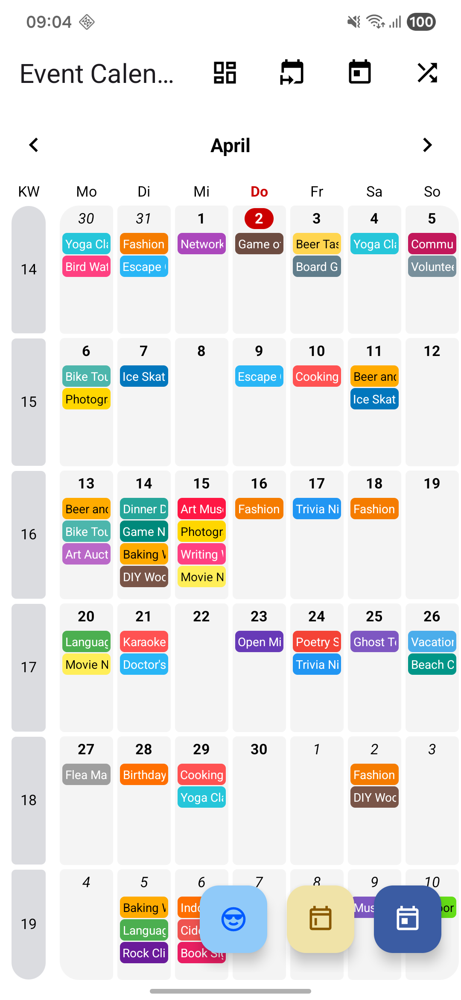

# EventCalendar

[](https://jitpack.io/#michael-winkler/EventCalendar)
[](https://github.com/michael-winkler/EventCalendar/commits)

[](https://android-arsenal.com/api?level=23)
[](https://android-arsenal.com/api?level=26)
[](http://www.apache.org/licenses/LICENSE-2.0)

A powerful and highly customizable **Event Calendar Library** for Android. Whether you are using the classic **XML/View System** or the modern **Jetpack Compose**, this library provides a smooth, Material 3 inspired calendar experience.

---

## 📸 Screenshots

<p align="center">
   &nbsp;&nbsp;&nbsp;&nbsp;
  
</p>
<p align="center">
  <i>Left: Jetpack Compose Module | Right: XML / View System Module</i>
</p>

---

## 📦 Modules

Choose the module that fits your project:

### 🚀 [EventCalendar Compose](./compose/README.md)
*For modern Jetpack Compose projects.*
- Built 100% with Compose.
- **Min SDK: 26**
- Supports horizontal paging.
- Custom `CalendarController` and `CalendarEventsStore`.
- **[Read Compose Documentation →](./compose/README.md)**

### 🏛️ [EventCalendar XML (View System)](./xml/README.md)
*For classic XML-based projects.*
- `EventCalendarView` & `EventCalendarSingleWeekView`.
- **Min SDK: 23**
- Paging via ViewPager2.
- Full XML attribute support.
- **[Read XML Documentation →](./xml/README.md)**

---

## 🛠 Installation

### 1) Add JitPack repository
Add it to your `settings.gradle.kts`:

```kotlin
dependencyResolutionManagement {
    repositories {
        google()
        mavenCentral()
        maven { url = uri("https://jitpack.io") }
    }
}
```

### 2) Add the dependency
Replace `LATEST_VERSION` with [](https://jitpack.io/#michael-winkler/EventCalendar)

```kotlin
dependencies {
    // For Jetpack Compose (Min SDK 26)
    implementation("com.github.michael-winkler.EventCalendar:compose:LATEST_VERSION")

    // For XML / View System (Min SDK 23)
    implementation("com.github.michael-winkler.EventCalendar:xml:LATEST_VERSION")
}
```

---

## 📱 Sample App
You can download the latest sample APK from the releases page:  
**[Download latest Sample App](https://github.com/michael-winkler/EventCalendar/releases)**

---

## 📄 License
```text
Copyright Author @NMD [Next Mobile Development - Michael Winkler]

Licensed under the Apache License, Version 2.0 (the "License");
you may not use this file except in compliance with the License.
You may obtain a copy of the License at

   http://www.apache.org/licenses/LICENSE-2.0

Unless required by applicable law or agreed to in writing, software
distributed under the License is distributed on an "AS IS" BASIS,
WITHOUT WARRANTIES OR CONDITIONS OF ANY KIND, either express or implied.
See the License for the specific language governing permissions and
limitations under the License.
```

---
If you like this library, feel free to **star** it! ⭐
