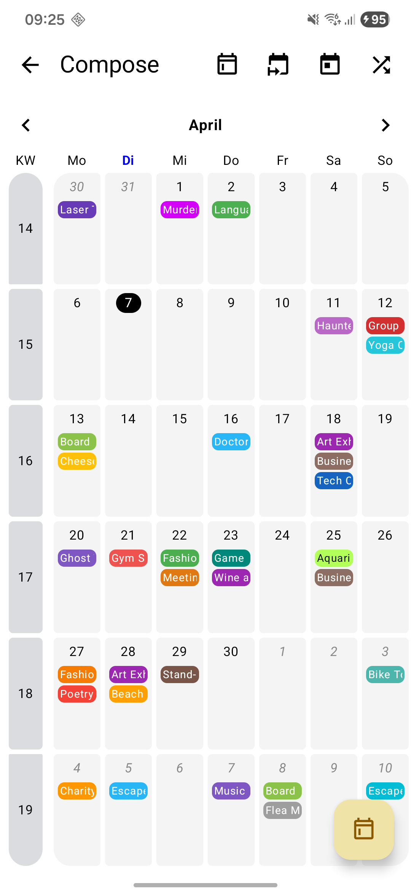

# EventCalendarCompose

A simple, highly customizable **month calendar** for **Jetpack Compose** with per-day events, optional ISO week numbers, and horizontal paging between months.

---

## 📸 Screenshot

<p align="center">
  
</p>

---

## Installation (JitPack)

### 1) Add JitPack repository

In your **root** `settings.gradle.kts`:

```kotlin
dependencyResolutionManagement {
    repositoriesMode.set(RepositoriesMode.FAIL_ON_PROJECT_REPOS)
    repositories {
        google()
        mavenCentral()
        maven { url = uri("https://jitpack.io") }
    }
}
```

### 2) Add the dependency
Replace `LATEST_VERSION` with [](https://jitpack.io/#michael-winkler/EventCalendar)

```kotlin
dependencies {
    implementation("com.github.michael-winkler.EventCalendar:compose:LATEST_VERSION")
}
```

---

## Requirements

- **Min SDK:** 26
- **Java:** 8+ (uses `java.time`)
- **Jetpack Compose:** 1.7.0+
- **Material3:** 1.2.0+

---

## Minimal Setup

```kotlin
@Composable
fun MyCalendarScreen() {
    val options = defaultCalendarOptions().copy(
        calendarWeekVisible = true
    )
    val controller = rememberCalendarController(options)
    val eventsStore = rememberCalendarEventsStore(
        initialEvents = listOf(
            Event(
                date = LocalDate.now(),
                name = "Project Kickoff",
                shapeColor = Color.Blue,
                textColor = Color.White
            )
        )
    )

    EventCalendarCompose(
        calendarStyle = defaultCalendarStyle(),
        calendarOptions = options,
        calendarController = controller,
        calendarEventsStore = eventsStore,
        onDaySelected = { day -> 
            println("Selected: ${day.date}")
        },
        onMonthChange = { month -> 
            println("Changed to: $month")
        }
    )
}
```

---

## Key Components

### 📅 Event Model
The `Event` class represents a calendar entry.
- **`date`**: `LocalDate` of the event.
- **`name`**: Title shown in the calendar.
- **`shapeColor`**: Background color of the event chip.
- **`textColor`**: Text color of the event chip.
- **`timeRange`**: Optional `EventTimeRange(startHour, startMinute, endHour, endMinute)`.

### 🎮 CalendarController
Use the controller to navigate programmatically:
- `controller.goToNextMonth()`
- `controller.goToPreviousMonth()`
- `controller.jumpToCurrentMonth()`
- `controller.goToMonth(YearMonth.of(2025, 12))`

### ⚙️ CalendarOptions
Configure the behavior of the calendar:
- `weekStart`: Set starting day (e.g., `DayOfWeek.MONDAY`).
- `calendarWeekVisible`: Show/hide ISO week numbers.
- `minDate` / `maxDate`: Restrict navigation range.
- `isCurrentWeekOnly`: If true, only the current calendar week is displayed. `minDate`, `maxDate` and `openEndedWindowMonths` will be ignored. The calendar will automatically filter and show only events that fall within the current week.

### 🎨 CalendarStyle
Customize colors, text sizes, and shapes:
- `monthNameTextColor`
- `dayItemBackgroundColor`
- `currentDayTextColor`
- and more...

---

## Features

- **Paging:** Smooth horizontal paging between months.
- **Dynamic Events:** Cells automatically handle multiple events; if more than 3 exist, the cell becomes scrollable.
- **Theming:** Full support for Material 3 and Dark Mode.
- **Lightweight:** Minimal dependencies, focused on performance.
