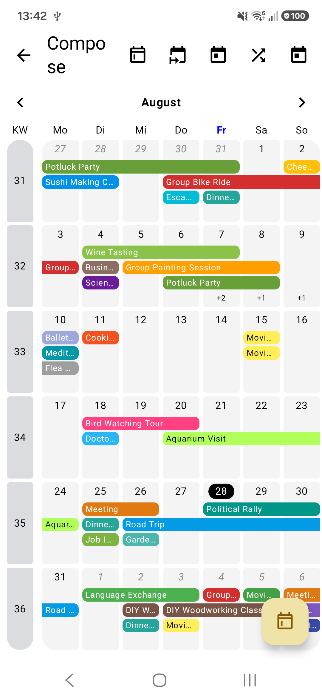

# EventCalendarCompose

A simple, highly customizable **month, week, and day calendar** for **Jetpack Compose** with
per-day events, **continuous multi-day events**, time-based layouts, optional ISO week numbers, and
horizontal paging.

---

## 📸 Screenshot

<p align="center">
  
</p>

---

## Installation (JitPack)

### 1) Add JitPack repository

In your **root** `settings.gradle.kts`:

```kotlin
dependencyResolutionManagement {
    repositoriesMode.set(RepositoriesMode.FAIL_ON_PROJECT_REPOS)
    repositories {
        google()
        mavenCentral()
        maven { url = uri("https://jitpack.io") }
    }
}
```

### 2) Add the dependency

Replace `LATEST_VERSION`
with [](https://jitpack.io/#michael-winkler/EventCalendar)

```kotlin
dependencies {
    implementation("com.github.michael-winkler.EventCalendar:compose:LATEST_VERSION")
}
```

---

## Requirements

- **Min SDK:** 23
- **Kotlin:** 2.0+
- **kotlinx-datetime:** 0.6.0+
- **Jetpack Compose:** 1.7.0+
- **Material3:** 1.2.0+
- **Localization:** Supports English, German, Czech, and Polish.

---

## Minimal Setup

```kotlin
@Composable
fun MyCalendarScreen() {
    val options = defaultCalendarOptions().copy(
        calendarWeekVisible = true
    )
    val controller = rememberCalendarController(options)

    // Using kotlinx-datetime to get current date
    val today = kotlinx.datetime.Clock.System.todayIn(TimeZone.currentSystemDefault())

    val eventsStore = rememberCalendarEventsStore(
        initialEvents = listOf(
            Event(
                date = today,
                name = "Project Kickoff",
                shapeColor = Color.Blue,
                textColor = Color.White
            )
        )
    )

    EventCalendarCompose(
        calendarStyle = defaultCalendarStyle(),
        calendarOptions = options,
        calendarController = controller,
        calendarEventsStore = eventsStore,
        onDaySelected = { day ->
            println("Selected: ${day.date}")
        },
        onMonthChange = { month ->
            println("Changed to: $month")
        }
    )
}
```

## Time-Based Week/Day View

For a more detailed view with time-based event positioning, use `EventCalendarWeekTime`. It
supports 1, 3, or 7-day layouts.

```kotlin
@Composable
fun MyWeekCalendarScreen() {
    val options = defaultCalendarOptions().copy(
        noOfVisibleDays = 7 // Use 1 for Day, 3 for 3-Day, 7 for Week view
    )
    val eventsStore = rememberCalendarEventsStore(
        initialEvents = listOf(
            Event(
                date = today,
                name = "Team Meeting",
                shapeColor = Color.Red,
                textColor = Color.White,
                timeRange = EventTimeRange(startHour = 9, startMinute = 0, endHour = 10, endMinute = 30)
            )
        )
    )

    EventCalendarWeekTime(
        calendarStyle = defaultCalendarStyle(),
        calendarOptions = options,
        calendarEventsStore = eventsStore,
        onDaySelected = { date ->
            println("Background clicked: $date")
        },
        onEventSelected = { event ->
            println("Event clicked: ${event.name}")
        }
    )
}
```

---

## Multi-Day Events

In the month view, an event that covers more than one day is rendered as a **single continuous bar**
across the day cells it spans. Bars are split correctly across week boundaries (the part in each week
keeps a flat edge where it continues) and stay correct for any configured `weekStart`.

There are two ways to create a multi-day event:

### 1) Explicit end date (recommended)

Give a single `Event` an inclusive `endDate`. This is unambiguous and also works for timed events
that cross midnight.

```kotlin
Event(
    date = LocalDate(2026, 8, 6),   // start (inclusive)
    name = "Vacation",
    shapeColor = Color(0xFF039BE5),
    textColor = Color.White,
    endDate = LocalDate(2026, 8, 11) // end (inclusive) — may cross weeks/months
)
```

`endDate` is optional and defaults to `null` (single-day). An `endDate` before `date` is ignored and
treated as single-day.

### 2) Auto-merge of consecutive events

If you model a multi-day event as several **separate** single-day `Event` objects of the same type
(same `name` + colors) on consecutive days, they are automatically combined into one continuous bar.
This is controlled by `CalendarOptions.mergeAdjacentEvents` (default `true`).

```kotlin
// These three separate events render as ONE "Conference" bar spanning Tue–Thu.
listOf(
    Event(LocalDate(2026, 8, 18), "Conference", Color(0xFF3949AB), Color.White),
    Event(LocalDate(2026, 8, 19), "Conference", Color(0xFF3949AB), Color.White),
    Event(LocalDate(2026, 8, 20), "Conference", Color(0xFF3949AB), Color.White),
)
```

Auto-merge is intentionally conservative so genuinely independent occurrences (e.g. a daily recurring
appointment) are **not** joined:

- Only **all-day** events (`timeRange == null`) are merged — timed events are always kept separate.
- Only pure single-day events participate — events that already declare an `endDate` are left as-is.
- Events must share the exact type (`name` + colors) and cover strictly consecutive, gap-free days.
- A day may hold several same-type events: one forms the span, any extras remain their own chips.

Set `mergeAdjacentEvents = false` to disable this and render every event on its own day.

> **Note:** Day selection is unaffected — `onDaySelected` still reports the individual events for the
> tapped day. Only the visual bar is merged.

---

## Key Components

### 📅 Event Model

The `Event` class represents a calendar entry.

- **`date`**: `LocalDate` (from `kotlinx.datetime`) of the event.
- **`name`**: Title shown in the calendar.
- **`shapeColor`**: Background color of the event chip.
- **`textColor`**: Text color of the event chip.
- **`timeRange`**: Optional `EventTimeRange(startHour, startMinute, endHour, endMinute)`.
- **`endDate`**: Optional inclusive end day for multi-day events (see
  [Multi-Day Events](#multi-day-events)). Defaults to `null` (single-day).

### 🎮 Entry Points

- **`EventCalendarCompose`**: Standard month-grid view.
- **`EventCalendarWeekTime`**: Time-grid view for 1, 3, or 7 days.

### 🎮 CalendarController

Use the controller to navigate programmatically:

- `controller.goToNextMonth()`
- `controller.goToPreviousMonth()`
- `controller.jumpToCurrentMonth()`
- `controller.goToMonth(YearMonth(2025, Month.DECEMBER))`

### ⚙️ CalendarOptions

Configure the behavior of the calendar:

- `weekStart`: Set starting day (e.g., `DayOfWeek.MONDAY`).
- `calendarWeekVisible`: Show/hide ISO week numbers.
- `minDate` / `maxDate`: Restrict navigation range.
- `isCurrentWeekOnly`: If true, only the current calendar week is displayed. `minDate`, `maxDate`
  and `openEndedWindowMonths` will be ignored. The calendar will automatically filter and show only
  events that fall within the current week.
- `noOfVisibleDays`: Number of days to show in `EventCalendarWeekTime` (1, 3, or 7).
- `mergeAdjacentEvents`: If `true` (default), separate single-day, all-day events of the same type on
  consecutive days are merged into one continuous multi-day bar (see
  [Multi-Day Events](#multi-day-events)).

### 🎨 CalendarStyle

Customize colors, text sizes, and shapes:

- `monthNameTextColor`
- `dayItemBackgroundColor`
- `currentDayTextColor`
- and more...

---

## Features

- **Paging:** Smooth horizontal paging between months.
- **Multi-Day Events:** Events spanning several days render as one continuous bar across day cells,
  split correctly across week boundaries and independent of the configured week start. Consecutive
  same-type events can be auto-merged (see [Multi-Day Events](#multi-day-events)).
- **Time-Based Grid:** Detailed weekly and daily views with precise event positioning and overlap
  handling.
- **Dynamic Events:** Cells automatically stack multiple events into aligned lanes; events that do
  not fit are collapsed into a per-day “+N” indicator.
- **Theming:** Full support for Material 3 and Dark Mode.
- **Lightweight:** Minimal dependencies, focused on performance.
- **KMP Ready:** Uses `kotlinx-datetime` and resource-based localization for future multiplatform
  support.
- **Backward Compatible:** Supports Android API level 23 and above without requiring Java 8+ API
  desugaring.
